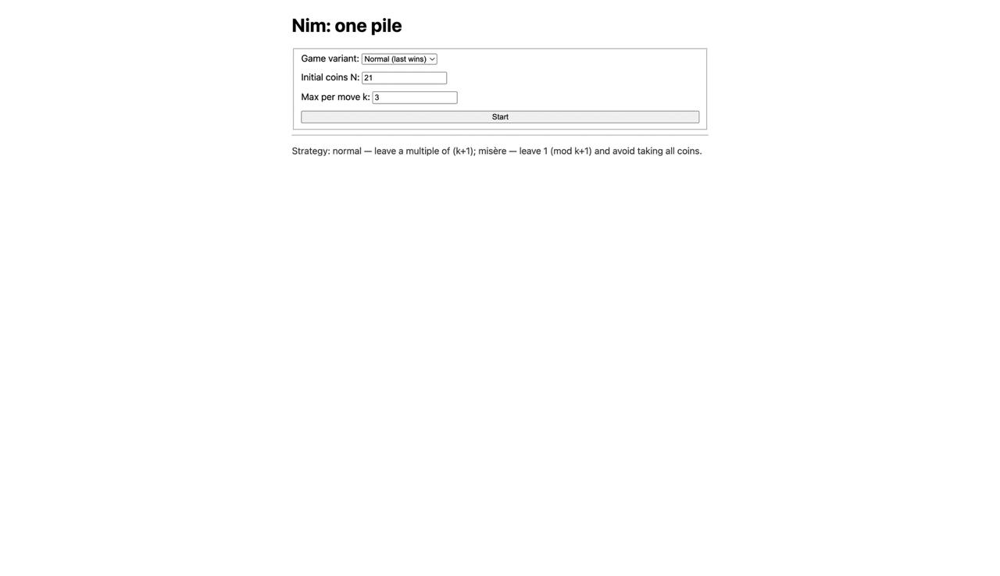

# Nim: one pile — Go + React (Dockerized)

A tiny full-stack demo of the **one-pile Nim** game with an optimal computer player.  
Backend is a REST API in **Go (GORM + MySQL)**, frontend is **React + Vite**, everything runs via **Docker Compose** (Nginx serves the SPA and proxies `/api`).

---
## Demo


---

## Features
- Optimal AI for one-pile Nim (normal & misère).
- Simple REST API to create a game and make moves.
- GORM models with MySQL.
- Clean separation of **engine**, **service**, **repository**, **handlers**.
- Unit tests for engine, handlers, repository, and service.
- One-command Docker deployment (frontend, backend, DB, Nginx).

---

## Tech stack
- **Backend:** Go, GORM, MySQL, net/http
- **Frontend:** React, TypeScript, Vite
- **Runtime:** Docker, Docker Compose, Nginx

---

## Project layout
```

.
├─ backend/
│  ├─ cmd/api/main.go
│  ├─ internal/
│  │  ├─ database/mysql.go
│  │  ├─ game/
│  │  ├─ handlers/handler.go
│  │  ├─ models/game.go
│  │  ├─ repositories/repository.go
│  │  └─ services/service.go
│  ├─ docker/entrypoint.sh
│  ├─ go.mod
│  ├─ go.sum
│  └─ Dockerfile
│
├─ frontend/
│  ├─ src/
│  │  ├─ components/
│  │  │  ├─ GameBoard.tsx
│  │  │  ├─ SetupForm.tsx
│  │  │  └─ StatusBar.tsx
│  │  ├─ api.ts
│  │  ├─ App.tsx
│  │  ├─ main.tsx
│  │  ├─ env.d.ts
│  │  └─ vite-env.d.ts
│  ├─ index.html
│  ├─ nginx.conf
│  ├─ package.json
│  ├─ tsconfig.json
│  ├─ vite.config.mts
│  └─ Dockerfile
│
├─ docker-compose.yml
├─ .env.example
└─ .gitignore

```

---

## Environment variables

Copy `.env.example` to `.env` in the **repo root** and adjust if needed:

```

# Backend / DB

DB_HOST=db
DB_PORT=3306
DB_USER=nimuser
DB_PASSWORD=nimpass
DB_NAME=nim
DB_PARAMS=parseTime=true&charset=utf8mb4&collation=utf8mb4_unicode_ci

# Backend HTTP

PORT=8080
CORS_ORIGINS=*

# Frontend

VITE_API_BASE_URL=/api

````

> In Docker, the frontend talks to the backend via Nginx using `/api`.  
> For local dev (without Docker), set `VITE_API_BASE_URL=http://localhost:8080/api`.

---

## Run with Docker (recommended)

```bash
docker compose up --build
# Frontend (Nginx): http://localhost
# Backend direct (if exposed): http://localhost:8080
````

Stop:

```bash
docker compose down
```

---

## Local development (without Docker)

### Backend

```bash
cd backend
go mod tidy
cp ../.env.example ../.env
go run ./cmd/api
```

### Frontend

```bash
cd frontend
npm ci
npm run dev   # http://localhost:5173
```

Set `VITE_API_BASE_URL=http://localhost:8080/api`.

---

## API

**Base URL (via Nginx in Docker):** `http://localhost/api`

### Create a new game

```
POST /api/new-game
Content-Type: application/json

{
  "variant": "normal",   // or "misere"
  "n": 21,
  "k": 3
}
```

**Response**

```json
{
  "id": "string",
  "variant": "normal",
  "k": 3,
  "remaining": 20,
  "player_turn": "human",
  "winner": ""
}
```

### Make a move

```
POST /api/take
Content-Type: application/json

{
  "id": "game-id",
  "take": 2
}
```

**Response** — updated state.

### Get game state

```
GET /api/game?id=<game-id>
```

---

## cURL quickstart

```bash
# New game
curl -sS -X POST http://localhost/api/new-game \
  -H "Content-Type: application/json" \
  -d '{"variant":"normal","n":21,"k":3}' | jq .

# Move
curl -sS -X POST http://localhost/api/take \
  -H "Content-Type: application/json" \
  -d '{"id":"<GAME_ID>","take":2}' | jq .

# State
curl -sS "http://localhost/api/game?id=<GAME_ID>" | jq .
```

---

## Testing

### Backend

```bash
cd backend
go test ./...
```

### Frontend

```bash
cd frontend
npm test
```

---

## Troubleshooting

* **Unknown collation `utf8mb4_0900_ai_ci`** → switch to `utf8mb4_unicode_ci` (already in `.env.example`).
* **Backend can’t connect to DB in Docker** → `DB_HOST=db`, not `localhost`.
* **Buttons disabled (Computer turn)** → some starts are losing for human; backend may auto-play computer’s first move.
* **404 from frontend when calling `/api`** → check `frontend/nginx.conf` and `VITE_API_BASE_URL`.

---
